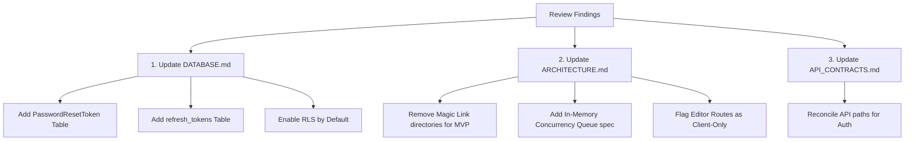

# DemoFlow — Architecture & Design Review

> **Version:** 1.0.0  
> **Document Type:** Multi-Perspective Quality Assurance & Architecture Review  
> **Reviewers:** Senior Angular Architect · Senior NestJS Architect · SaaS Founder · Product Designer  
> **Source Documents:** ARCHITECTURE.md, DATABASE.md, API_CONTRACTS.md, UX_ARCHITECTURE.md, DESIGN_SYSTEM.md, MVP.md, ROADMAP.md, FEATURES.md  
> **Last updated:** 2026-06-24

---

## Executive Summary

This review evaluates the alignment, technical feasibility, security, and user experience of DemoFlow based on the current documentation. The goal is to identify contradictions, security gaps, performance bottlenecks, and design anomalies before any code is written, ensuring a smooth path to market for a solo developer.

---

## 1. Contradictions Across Documents

We identified several discrepancies where documents disagree on the scope or execution of key features.

### 1.1 Authentication Strategy (Magic Links vs. Password)
*   **The Conflict:** 
    *   `MVP.md` and `FEATURES.md` state that the MVP strictly uses **email/password** authentication, postponing Magic Links to v1.0.
    *   `ARCHITECTURE.md` (lines 147-151) lists a `magic-link/` feature directory, a `magic-link.strategy.ts` file, and `POST /auth/magic-link` endpoints as part of the core structure.
    *   `ROADMAP.md` places Magic Links in v1.5 (Weeks 12-17), contradicting both `MVP.md` (v1.0) and the initial structural layout.
*   **The Fix:** Remove the magic link folders and code references from the MVP architecture directory layout in `ARCHITECTURE.md`. Standardize on email/password for the MVP, and list Magic Links as a v1.0 target across all documents.

### 1.2 Workspace and Tenant Linking
*   **The Conflict:**
    *   `DATABASE.md` lists the `workspace_members` junction table as ❌ **Not in MVP** (to be built in v1.0). Instead, it proposes that `workspaces` has an `owner_id` pointing directly to a user.
    *   However, `FEATURES.md` and `UX_ARCHITECTURE.md` imply that workspace-scoped isolation exists from Day 1, and `API_CONTRACTS.md` returns user objects with workspace IDs.
    *   If `workspace_members` is omitted in the MVP, the app assumes a strict 1-to-1 mapping of users to workspaces.
*   **The Fix:** Retaining `owner_id` on the `workspaces` table works for a single-user MVP, but it creates a massive refactoring task for v1.0 when teammates are introduced. Every query scoping resource by `workspace_id` will have to change from traversing `users -> workspaces -> projects` to checking the junction table. We recommend including the `workspace_members` table in the MVP DB schema with a strict `UNIQUE(workspace_id, user_id)` constraint, but limiting UI creation options to keep it simple.

### 1.3 Refresh Token Mechanism
*   **The Conflict:**
    *   `DATABASE.md` states that the `refresh_tokens` table is ❌ **Not in MVP** and will use a simple `refresh_token_hash` string field on the `users` table instead.
    *   `API_CONTRACTS.md` and `ARCHITECTURE.md` outline a rotation-based refresh token strategy.
*   **The Fix:** Storing a single `refresh_token_hash` on the `users` record means a user can only have **one active session at a time**. If they log in on their desktop and then their laptop, the first device's session will be destroyed the next time it attempts to refresh (rotation occurs every 15 minutes due to access token expiry). This is a critical UX failure. The `refresh_tokens` database table must be included in the MVP to support multi-device sessions.

---

## 2. Missing Features & Database Entities

Essential elements required to run the application that are currently absent from the specifications.

### 2.1 Password Reset Tokens
*   **Gaps:** `FEATURES.md` and `MVP.md` specify a "Forgot Password" email flow for the MVP. However, `DATABASE.md` does not define a table or mechanism for password reset tokens.
*   **Impact:** Without a `password_reset_tokens` table (or similar temporary token storage), the system cannot verify reset requests securely.
*   **Recommendation:** Add a `password_reset_tokens` table to `DATABASE.md` (MVP-enabled):
    ```prisma
    model PasswordResetToken {
      id        String   @id @default(uuid())
      userId    String
      tokenHash String   @unique
      expiresAt DateTime
      createdAt DateTime @default(now())
    }
    ```

### 2.2 Upload Cleanup & Orphaned Files
*   **Gaps:** Users can upload media assets and delete them or delete scenes containing them. There is no background worker or database hook specified to delete the actual physical files from Cloudflare R2 when database records are deleted.
*   **Impact:** S3/R2 storage costs will grow indefinitely due to orphaned raw screenshots and video assets.
*   **Recommendation:** Add a soft-delete cleanup cron schedule or event handler to trigger file deletions in the object storage layer when a `MediaAsset` is permanently deleted (after a 30-day safety retention period).

---

## 3. Server-Side Rendering (SSR) Risks
*(Perspective: Senior Angular Architect)*

The use of Angular 20 SSR with client hydration introduces critical performance and development risks.

```
┌────────────────────────────────────────────────────────┐
│ Angular SSR Server (Node.js)                           │
│  [ Attempting to render Scene Editor Component... ]    │
│  │                                                     │
│  ▼ CRASH: "window is not defined"                      │
│    (PIXI.js / Canvas2D API accessed on server)         │
└────────────────────────────────────────────────────────┘
```

### 3.1 Third-Party Canvas and DOM Manipulation
*   **Risk:** The Scene Editor Canvas uses Canvas2D or PIXI.js. These APIs require browser globals (`window`, `document`, `HTMLCanvasElement`, `navigator`, `requestAnimationFrame`). During SSR, Angular executes components on the Node.js server where these do not exist.
*   **Impact:** The server will crash or return `500 Internal Server Error` whenever an unauthenticated visitor or search engine crawls an editor route, or when page hydration fails.
*   **Mitigation:** 
    *   The `/projects/:id/editor` route must be strictly configured as a **Client-Side Rendered (CSR) page** using Angular's routing config (disable SSR for the editor module).
    *   Wrap canvas-rendering engine initializations inside a check for `isPlatformBrowser(platformId)` or load them dynamically using lazy `import()` statements in `ngOnInit`.

### 3.2 Dynamic Player Hydration
*   **Risk:** The public demo player (`/demo/:shareId`) is set to be SSR-rendered for SEO benefits (OpenGraph metadata). If the player shell loads the heavy interactive canvas on the server, it will face the same crash issues as the editor.
*   **Mitigation:** The server should only render the static HTML wrapper and the `<meta>` tags (for Twitter, Slack, and Google crawls). The interactive canvas components inside the player must be wrapped in `@defer` blocks or deferred to client execution.

---

## 4. Security Risks
*(Perspective: Senior NestJS Architect)*

### 4.1 Missing Database Row-Level Security (RLS)
*   **Risk:** `DATABASE.md` postpones PostgreSQL RLS to v2.0, relying solely on application-layer `where: { workspaceId }` filtering.
*   **Impact:** If a solo developer forgets to add a `workspaceId` check in a single query (e.g., in a bulk media deletion or metadata update service), a tenant will be able to read or mutate another tenant's private assets.
*   **Mitigation:** Enable PostgreSQL RLS on all tenant-scoped tables from Day 1. It takes less than 30 minutes to set up during migrations and acts as an ironclad safety net:
    ```sql
    ALTER TABLE projects ENABLE ROW LEVEL SECURITY;
    CREATE POLICY project_workspace_isolation ON projects
      USING (workspace_id = current_setting('app.current_workspace_id', true)::uuid);
    ```

### 4.2 FFmpeg Shell Injection
*   **Risk:** Executing shell commands for FFmpeg compilation using user-supplied parameters (e.g., project titles or file paths) introduces shell execution risks.
*   **Impact:** Arbitrary Remote Code Execution (RCE) on the NestJS API server.
*   **Mitigation:**
    *   Do **not** spawn child shells directly (`exec("ffmpeg -i " + file)`).
    *   Use a structured wrapper like `fluent-ffmpeg` or pass arguments as strict string arrays using `spawn`.
    *   Enforce strict alphanumeric sanitization on all output filenames before passing them to FFmpeg.

### 4.3 Exposed Media Assets
*   **Risk:** To render screenshots/videos in the browser canvas, the assets must be accessible. If R2 URLs are public, anyone who guesses the asset's UUID can access private customer dashboards or screen captures.
*   **Mitigation:**
    *   Use **Cloudflare R2 Presigned URLs** for all editor assets. Set a short expiration time (e.g., 2 hours).
    *   The frontend must query the API to fetch fresh presigned URLs before loading assets onto the canvas.
    *   Public share pages (`/demo/:shareId`) must serve assets through a proxied endpoint or use specific read-only public buckets with distinct UUID hashes.

---

## 5. Scalability & Hosting Risks
*(Perspective: Senior NestJS Architect & SaaS Founder)*

### 5.1 CPU Starvation on VPS due to FFmpeg
*   **Risk:** `MVP.md` rejects BullMQ/Redis for the MVP, stating that running FFmpeg synchronously or with a simple job polling table is acceptable.
*   **Impact:** A single FFmpeg rendering process encoding a 30fps 1080p video uses 100% of available CPU cores. On a $24/month VPS, if two users click "Export" at the same time, the API gateway will lock up, database queries will timeout, and the website will go offline.
*   **Mitigation:** Do not run FFmpeg in the same Node.js process as the HTTP API. Instead:
    *   Implement a simple **in-memory task runner** (like a promise queue with a concurrency limit of 1) inside the NestJS app if Redis/BullMQ is excluded.
    *   This ensures exports are processed sequentially, protecting the server from CPU starvation at the cost of slight export delays for concurrent users.

```
Without Concurrency Limit:
User A Export ──▶ [FFmpeg Core 1 (100% CPU)] ──┐
User B Export ──▶ [FFmpeg Core 2 (100% CPU)] ──┼──▶ [Server Freezes / Offline]
API Requests ───▶ [Node.js Event Loop Blocked] ┘

With Concurrency Limit (Queue):
User A Export ──▶ [Active: FFmpeg (100% CPU)]
User B Export ──▶ [Queued in Memory] ──────────▶ Waits until User A completes
API Requests ───▶ [Node.js Event Loop Free]  ──▶ Responds immediately (200 OK)
```

### 5.2 Local Ollama Inference Hosting Constraints
*   **Risk:** The MVP relies on Ollama running Qwen-VL locally on the VPS host.
*   **Impact:** Qwen-VL:7B requires at least 8GB of VRAM (GPU) to run at an acceptable speed. Running this on a cheap CPU-only VPS will take 5-10 minutes per screenshot analysis, rendering the "WOW moment" useless.
*   **Mitigation:**
    *   **Development:** Run Ollama locally on the founder's Apple Silicon Mac.
    *   **Production (MVP):** Do not host Ollama on the CPU VPS. Instead, swap the AI provider to use a cost-efficient cloud vision API (like OpenAI's `gpt-4o-mini` or Cloudflare Workers AI) for the production launch. This eliminates hosting costs and ensures sub-second analysis times.

---

## 6. User Experience (UX) Bottlenecks
*(Perspective: Product Designer)*

### 6.1 Interactive Player Keyboard Navigation
*   **Problem:** The public player is described as mobile-friendly and interactive, but lacks keyboard support specifications.
*   **Impact:** Desktop viewers navigating a shared demo will try to use the `Spacebar` or `Arrow Keys` to step through scenes. If this is not implemented, the experience will feel sluggish and unpolished compared to competitors like Loom or Arcade.
*   **Fix:** Add keyboard event listeners (`Space`, `ArrowRight` -> Next Scene, `ArrowLeft` -> Previous Scene) directly to the player layout.

### 6.2 Pixel Mapping and Screen Densities
*   **Problem:** When users place annotations (arrows, text) on a screenshot on their high-DPI (Retina) display, and the coordinates are saved as absolute percentages, the annotations might shift or look fuzzy on low-DPI displays.
*   **Fix:** Force the canvas wrapper to render at a virtual fixed resolution (e.g., `1920x1080` coordinate space) and use CSS transform scaling (`scale()`) to fit any device. This guarantees pixel-perfect annotation alignment.

---

## 7. Scope Creep & Distractions
*(Perspective: SaaS Founder)*

For a solo developer aiming to launch in 8 weeks, the following documentation elements add unnecessary noise and should be removed from the initial codebase implementation:

1.  **Nx Monorepo Configuration:** Re-evaluating the choice of Nx. While great for teams, setting up custom Nx generators and configurations adds overhead.
    *   *Decision:* Start with two standalone directories (`/client` and `/api`) within a single git repository. Avoid complex Nx workspace libraries until the first hires are made.
2.  **Unused Tables in schema.prisma:** Keeping schema code for features like `audit_logs`, `share_analytics`, and `templates` in the main database file forces migration maintenance before the code is actually written.
    *   *Decision:* Comment out or delete all tables marked as non-MVP in `DATABASE.md` from the active `schema.prisma` file. Only keep what is active for the week 1-8 sprint.

---

## 8. Actionable Recommendation Plan

To align our documents and prepare for development, execute the following updates:



1.  **DATABASE.md:** 
    *   Re-introduce the `refresh_tokens` table to allow multi-device logins.
    *   Add the `PasswordResetToken` table to secure the "Forgot Password" flow.
    *   Configure PostgreSQL RLS policies in the database blueprint schema.
2.  **ARCHITECTURE.md:**
    *   Mark editor routes as client-only CSR in the Angular section to protect the SSR server.
    *   Replace the BullMQ/Redis queue architecture with an in-memory sequential queue spec for the NestJS export controller.
3.  **API_CONTRACTS.md:**
    *   Reconcile the authentication endpoints: ensure `/auth/magic-link` is explicitly grouped under the post-launch phase, and verify that all current MVP endpoints match the `FEATURES.md` matrix.
